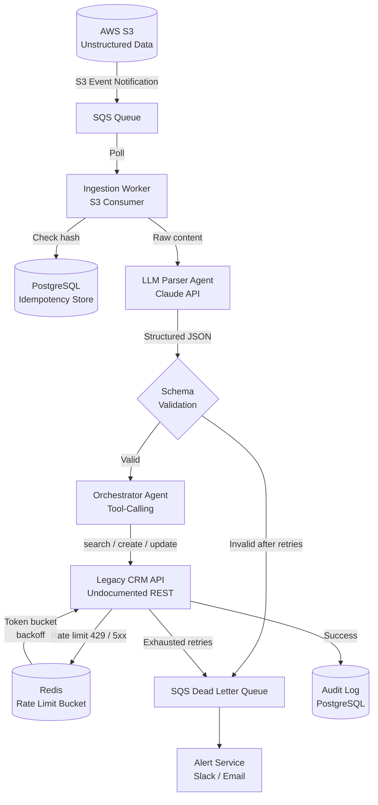

# FDSE Assignment — Enterprise Data & Agentic Workflow Integration

> **Problem Statement:** An enterprise client wants to automate their customer onboarding. They have a legacy CRM with an undocumented REST API and unstructured data sitting in an AWS S3 bucket. Architect an AI agent-driven workflow that can ingest the S3 data, parse it using an LLM, handle errors if the legacy API rate-limits or fails, and successfully update the client system.

---

## Architecture Diagram



---

## Data Flow

| Step | Component | Detail |
|------|-----------|--------|
| 1 | **S3 → SQS** | Object uploaded; S3 Event Notification triggers SQS message with bucket + key |
| 2 | **Ingestion Worker** | Downloads object, computes SHA-256 hash as idempotency key |
| 3 | **Idempotency Check** | Queries PostgreSQL — if hash seen before, skip (prevents duplicate processing) |
| 4 | **LLM Parser** | Sends raw content + JSON schema to Claude API — model extracts structured `Customer` fields |
| 5 | **Validation** | Jakarta Validation on extracted DTO. If invalid, retry LLM with repair prompt (max 2 attempts) → else DLQ |
| 6 | **Orchestrator Agent** | Tool-calling agent: `crm.search(email)` → decides CREATE or UPDATE plan |
| 7 | **CRM Client** | Executes plan through Resilience4j stack: Retry → CircuitBreaker → RateLimiter |
| 8 | **Audit Log** | On success: write correlation-ID-tagged audit entry. On failure: push to DLQ + alert |

---

## Resilience Design

### Retry + Exponential Backoff with Jitter
- Max 5 attempts
- Base delay 500ms, multiplier 2×, ±20% jitter
- Retries on: `ConnectException`, `SocketTimeoutException`, HTTP 5xx, HTTP 429

### Circuit Breaker (Resilience4j)
- Opens after 50% failure rate in a 20-call sliding window
- Half-open after 30s cooldown
- Prevents thundering herd on a struggling CRM

### Rate Limit Handling
- Respects `Retry-After` header on 429 responses
- Redis token bucket sized to (CRM published limit × 0.8) for safety margin
- Separate bucket per CRM endpoint

### Idempotency
- Every CREATE includes `Idempotency-Key: sha256(s3_key + customer_email)` header
- Prevents duplicate records when retrying after partial success

### Dead Letter Queue
- Messages that exhaust all retries land in SQS DLQ
- Structured log entry with full error chain, correlation ID, original payload
- Alert fires to Slack/email via SNS

---

## Tech Stack

| Layer | Choice | Reason |
|-------|--------|--------|
| Framework | Spring Boot 3.2 | Matches existing expertise; excellent Resilience4j + AWS SDK integration |
| Resilience | Resilience4j | Fine-grained Retry/CB/RateLimiter composition; better than Spring Retry for this use case |
| Queue | AWS SQS | Cost-effective for enterprise PoC; Kafka would be overkill without streaming requirements |
| LLM | Claude 3 Sonnet API | Strong instruction-following for schema extraction; JSON mode reliable |
| DB | PostgreSQL | Idempotency store + audit log; ACID guarantees needed for exactly-once semantics |
| Cache | Redis | Token bucket for rate limiting; fast TTL-based operations |
| Local Dev | LocalStack + WireMock | LocalStack mocks S3/SQS; WireMock simulates chaotic legacy CRM (429s, 500s, timeouts) |
| Observability | SLF4J + MDC (correlation IDs) | Structured logs traceable end-to-end across worker → LLM → CRM |

### Why not Kafka?
SQS is simpler to operate and sufficient here — we need reliable delivery with DLQ, not stream processing or replay semantics. Kafka's overhead (ZooKeeper/KRaft, consumer group management) isn't justified for an onboarding workflow.

---

## Project Structure

```
fdse-onboarding-agent/
├── README.md
├── docs/
│   └── architecture.md          # Extended design decisions
├── docker-compose.yml           # LocalStack, PostgreSQL, Redis, WireMock
├── pom.xml
└── src/
    ├── main/java/com/ayush/onboarding/
    │   ├── config/
    │   │   ├── Resilience4jConfig.java
    │   │   ├── AwsConfig.java
    │   │   └── RedisConfig.java
    │   ├── model/
    │   │   ├── Customer.java
    │   │   ├── OnboardingRecord.java
    │   │   └── ProcessingStatus.java
    │   ├── ingestion/
    │   │   ├── S3SqsConsumer.java
    │   │   └── IdempotencyService.java
    │   ├── parser/
    │   │   ├── LlmParserAgent.java
    │   │   └── CustomerExtractionPrompt.java
    │   ├── orchestrator/
    │   │   └── OnboardingOrchestrator.java
    │   ├── crm/
    │   │   ├── CrmClient.java
    │   │   └── CrmApiException.java
    │   ├── resilience/
    │   │   └── RateLimitHandler.java
    │   └── audit/
    │       └── AuditService.java
    └── test/java/com/ayush/onboarding/
        ├── ingestion/
        │   └── IdempotencyServiceTest.java
        ├── crm/
        │   └── CrmClientResilienceTest.java
        └── parser/
            └── LlmParserAgentTest.java
```

---

## Running Locally

### Prerequisites
- Docker + Docker Compose
- Java 21
- Maven 3.9+

### Start dependencies
```bash
docker compose up -d
```

### Configure
```bash
# src/main/resources/application.yml already has LocalStack defaults
# Only real key needed:
export ANTHROPIC_API_KEY=your_key_here
```

### Run
```bash
mvn spring-boot:run
```

### Simulate onboarding
```bash
# Upload a test file to LocalStack S3 (triggers the whole pipeline)
aws --endpoint-url=http://localhost:4566 s3 cp docs/sample-customer.json s3://onboarding-bucket/
```

### Run tests (includes WireMock chaos tests)
```bash
mvn test
```

---

## Design Tradeoffs & Decisions

See [`docs/architecture.md`](docs/architecture.md) for detailed discussion of:
- LLM parser vs regex/rule-based extraction
- Resilience4j vs Spring Retry
- SQS vs Kafka
- Idempotency strategy choices
- Schema validation approach
# fdse-onboarding
